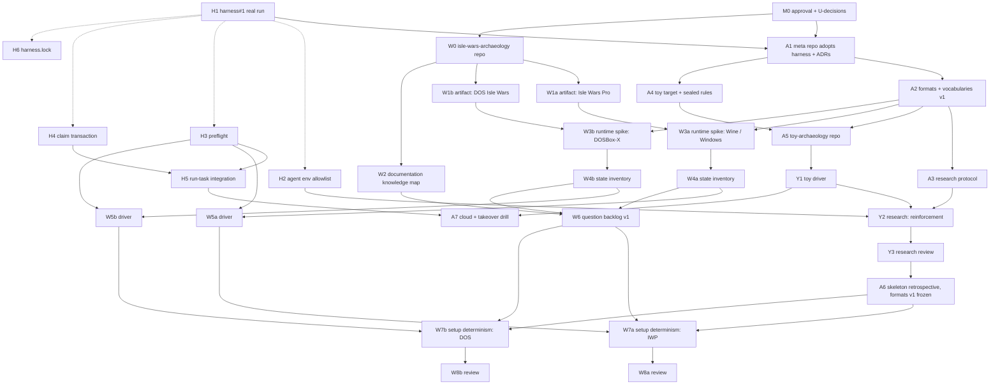

# 07 · Delivery plan

## 1. ADRs (only decisions that constrain future work)

| ADR | Decision | Constrains | Status |
| --- | --- | --- | --- |
| 001 | Repository topology: harness (process) · meta repo (method) · repo per game · private stores per game; dependency direction (02 §3) | where every later file goes | **Accepted 2026-10-02** |
| 002 | Adopt `harness_imperial`; archaeology repos contain no orchestration code; process gaps are fixed upstream with a lesson | prevents a second runner/label system | **Accepted 2026-10-02**; operational readiness **confirmed by H1** (harness#1, a full real `/run-task` loop, 2026-10-02) |
| 003 | Task contract = harness core + `Runs on` + kind extensions (03 §2) | every task file | **Accepted 2026-10-02** |
| 004 | Environment model: requirement vs declaration vs verified; preflight before claim; cloud classes C0–C4; network classes N0–N4; env allowlist for agents (04) | every machine-specific task | **Accepted 2026-10-02**; token list provisional |
| 005 | Claim = atomic `claim/T<nn>` ref + `machine:<id>` label + claim comment with lease (03 §7) | multi-machine operation | **Accepted 2026-10-02**; mechanism provisional until H4's race test |
| 006 | Artifact identity by set manifest hash; variants by recipe; originals never in any repo; per-game rights decision (05) | storage and reproducibility | **Accepted 2026-10-02** |
| 007 | Evidence provenance: immutable run records with interventions I0–I3; raw never carries interpretation; representation claims license decoding (06 §2–5) | every experiment | **Accepted 2026-10-02**; fields provisional |
| 008 | Claim lifecycle and promotion: status/basis/scope; two-axis research verdict; only the main session edits `spec/` after review (03 §6, 06 §4) | the specification | **Accepted 2026-10-02** |
| 009 | Generalization policy: game-specific by default; generic only with two concrete uses; the register in 02 §5 | every "framework" proposal | **Accepted 2026-10-02** |

Not ADRs: language choices (noted in 02 §6), the toy target's design (a task), names (a user choice).

## 2. Milestones (capability jumps)

| Milestone | Becomes possible | Demonstrated by | Unlocks | Seam for fan-out? |
| --- | --- | --- | --- | --- |
| **M0 Architecture approved** | work can be contracted | this package reviewed; U-decisions answered; ADRs 001–009 accepted | everything | — |
| **M1 Process operational** | cold agents execute tasks in the meta repo | harness#1 done (a real `implement.mjs` run); meta repo adopts harness (A1 merged with green CI) | M2, M3 | no |
| **M2 Walking skeleton** | the archaeology loop is proven on a hidden-rule target | toy finding reviewed by an independent reviewer who reruns runs; scored against SEALED.md; A6 retrospective merged with formats v1 frozen | toy research fan-out; W7a, W7b | **yes**: formats + research protocol stable |
| **M3 Many machines** | any capable machine or cloud session can safely find, claim, resume | H3–H5 merged; two-machine race test (exactly one claim wins); a cloud session runs a toy research task end to end; a takeover drill resumes a pushed branch on another machine | parallel work across machines | **yes**: claim + preflight |
| **W-M1 Isle Wars runtime** (per artifact: `a` = Isle Wars Pro, `b` = DOS Isle Wars) | an agent can launch → act → observe → reset that verified artifact | W1x, W3x, W4x, W5x merged for that artifact; preflight verifies `artifact:<set>` and the runtime tokens on the machine that ran it; W5x repeats a launch/act/observe/reset cycle 10× | W7x | partly (each driver is the seam for that artifact's experiments) |
| **W-M2 First reviewed Isle Wars finding** | the Isle Wars research pipeline is real; spec exists | the first W7x finding approved by an independent research review that reran selected runs, and promoted into `spec/` with its artifact scope. The second artifact's W7 then shows the first cross-artifact comparison. | Isle Wars research fan-out | **yes** |
| **M4 Fan-out + first extraction review** | parallel Isle Wars questions on several machines; code duplicated across the toy driver and the two Isle Wars drivers (Wine and DOSBox-X) considered for extraction against the register | ≥3 Isle Wars research tasks in flight on ≥2 machines without claim/Owns conflicts; an architecture task decides extraction | second real game | — |

Considered and rejected: "M1 = build the framework library" (no consumer yet); "Isle Wars before the
skeleton" (formats untested on a target whose truth is known); "multi-machine first" (nothing to run).
W-M1 runs **in parallel** with M1–M3. It depends on just two early generic pieces, A2's `run/1`
schema (for W3x's run records) and H3's preflight (for W5x and the milestone check), plus the user's
copies of the artifacts (U11) and on the W3 spikes. Its two artifact lanes (`a`, `b`) are also
parallel to each other: their Owns paths are disjoint (`runtime/iwp/**` vs `runtime/iw-dos/**`), and
they may run on different machines.

## 3. Dependency graph

Solid = Merge after; dotted = Start after (soft).

## 4. Initial backlog

**IDs.** H/A/Y/W labels are this plan's names only. In each repository a task is a file
`docs/tasks/T<nn>.md` numbered in that repo's own sequence (the harness requires `T\d{2,3}`). The
mapping is written once, in the task's issue title, e.g. `T13 Preflight (H3)`. So "T02" in the meta
repo and "T02" in `toy-archaeology` are different tasks.

Repos: **H** = `harness_imperial` (filed in its issues; its own process applies), **A** = meta repo,
**Y** = `toy-archaeology`, **W** = the Isle Wars repo. Agent class: *arch* = architecture-level
(Opus / main session), *impl* = cheap implementer (OpenCode) with a different-family reviewer,
*res* = researcher (Claude), *rrev* = research reviewer (Claude Opus).

| ID | Kind / agent | Produces | Owns | Depends | Runs on (caps) | Cloud | Services | Network | Artifacts | Durable state for resume | Reviewer falsifies by |
| --- | --- | --- | --- | --- | --- | --- | --- | --- | --- | --- | --- |
| H1 | env / user + main — **done 2026-10-02** | a full real `/run-task` loop on `harness-scratch` (implement 81 s, review 75 s, merged); `npm test` 104/104 (harness#1 comments) | per harness#1 | — | base, `svc:opencode-go` | C3 (desktop keys) | OpenCode Go | N2 | — | harness#1 comments | rerun `npm test` + inspect the real run's PR |
| H2 | infra / impl | `implement.mjs`/`review.mjs` pass only allowlisted env vars | `template/tools/harness/**`, `test/**` | H1 (soft) | base | C0 | provider | N2 | — | branch | test: a var not on the allowlist is absent inside the fake opencode; mutate allowlist → test fails |
| H3 | env / impl | `preflight.mjs`, `Runs on` parser, generic checks, `capabilities.json` merge; `svc:` checks reuse the harness's `prepareOpenCode()` and do not duplicate it | `template/tools/harness/preflight.mjs`, `lib/caps.mjs`, `test/preflight*`, `template/docs/environment.md`, `.github/workflows/ci.yml` | H1 (soft) | base | C0 | — | N1 | — | branch | (Example 3) |
| H4 | infra / impl | `claim.mjs claim/release/status/takeover` | `template/tools/harness/claim.mjs`, `lib/claim.mjs`, `test/claim*`, fake-gh extension | H1 (soft) | base | C0 (+ one real race test on a scratch repo) | — | N1 | — | branch | (Example 2) |
| H5 | infra / impl | `/run-task` step 0 = preflight + claim; a draft PR opened right after the claim (proves `gh:pr` early, 04 §4); brief identity + preflight blocks; release on stop | `template/.claude/skills/run-task/SKILL.md`, `template/docs/process.md` §3–4, §8 | H3, H4 | base | C0 | — | N1 | — | branch | dry-run `/run-task` on a fake task that fails preflight → no claim ref created |
| H6 | infra / impl | `harness.lock` + bump procedure in README | `README.md`, `template/harness.lock`, doc section | H1 (soft) | base | C0 | — | N1 | — | branch | follow the procedure on a scratch copy; diff matches |
| A1 | arch / main session | harness copied + lock; `CLAUDE.md`; ADR-001..009 from this package; labels created | `CLAUDE.md`, `docs/adr/**`, `docs/phase0/**`, harness template paths | M0, H1 | base | C0 | — | N1 | — | PR | reviewer checks each ADR traces to a section of the package and a U-decision; CI green |
| A2 | arch / Opus | schemas `run/1`, `artifact-set/1`, `variant/1`, `evidence-manifest/1`; finding + spec templates; legends | `formats/**`, `vocabulary/**` | A1 | base | C0 | — | N1 | — | PR | (Example 1) |
| A3 | arch / Opus | researcher brief block, research-review brief block, promotion procedure | `method/research-protocol.md` | A2 | base | C0 | — | N1 | — | PR | reviewer applies the review block to a fabricated finding with a planted confound; the block must catch it |
| A4 | feature / impl (author of SEALED is this implementer. Its reviewer must read SEALED, so the A4 implementer and reviewer sessions are recorded on the issue and never dispatched to Y2, Y3 or another toy research task. The main session does not read SEALED until A6) | in the **private `toy-target` repo** (U12): toy target 1.0 + 1.1, SEALED.md, tests per hidden rule, zipapp build, release | the whole `toy-target` repo | A1, U12 | base, `tool:python@>=3.11` | C0 | — | N1 | — (generates one) | branch + release | each SEALED rule has a test that fails when the rule is removed; build twice → identical pyz hash |
| A5 | infra / main session (repo approved, U10) | `toy-archaeology` repo: harness, layout, `artifacts/known.json`, `capabilities.json`, CLAUDE.md; the toy `.pyz` attached as a release asset (copied by hash from `toy-target`'s release) | new repo | A2, A4 | base | C0 | — | N1 | toy artifact by hash | repo | cold clone + `preflight --machine` on a fresh cloud session verifies `artifact:toy-*` |
| Y1 | runtime / impl | toy driver: launch/act/observe/save/restore/dump; `register_artifact.py`; run-record writer validating `run/1` | `runtime/**`, `tools/**`, `tests/**` | A5 | base, `tool:python@>=3.11`, `artifact:toy-1.0-*` | C0 | — | N1 | toy | branch | delete the restore-hash recording → its test fails; two runs same seed → identical run-record observations |
| Y2 | research / res | E001 runs + evidence + F001 (proposed) on reinforcement | `experiments/E001-*/`, `runs/E001/`, `evidence/E001/`, `findings/F001-*` | Y1, A3, H2 | as Y1 + `gh:release-write:toy-archaeology` (bundles as releases on the toy repo itself: non-copyrighted, rehearses the real upload path); **GitHub access limited to `toy-archaeology`** (a scoped cloud session, or OpenCode with a repo-scoped token; never the owner's `gh` login — 06 §10) | C0 | — | N1 | toy | branch: runs pushed before finding | (Example 5 / 6) |
| Y3 | research-review / rrev | review comment, two-axis verdict; afterwards SEALED score | none (read-only) | Y2 | as Y1 | C0, **different machine or session from Y2** | — | N1 | toy | PR comment + label | (Example 6) |
| A6 | arch / main session | retrospective: score vs SEALED, every format friction → amendment; formats v1 frozen; tag `formats-v1` | `formats/**`, `vocabulary/**`, `method/**`, `lessons.md` | Y3 | base | C0 | — | N1 | — | PR | reviewer checks every amendment cites a Y-task observation |
| A7 | env / main session + 2 machines | drill report: race test, cloud claim+run of a toy task, takeover and resume on another machine | `method/drills/**` | H5, Y1 | base + per drill | C0 + a local machine | — | N1/N2 | toy | issue comments + branches | reviewer replays the claim log: exactly one 201 per claim; takeover branch history continuous |
| W0 | infra / main session (repo approved, U10) | **private** `isle-wars-archaeology` repo (U5): harness, layout with per-artifact dirs (`runtime/iwp/`, `runtime/iw-dos/`), `knowledge-map.md` skeleton with one status column per artifact (all `unknown`) | new repo | M0, U10 | base | C0 | — | N1 | — | repo | — |
| W1a / W1b | env+research / res + **user** | per artifact: `artifacts/known.json` entry, manifest, version facts, runtime-write list, where the shareware copy came from (U11) and any unregistered-version limits seen. Never the bytes. | `artifacts/iwp/**` / `artifacts/iw-dos/**`, own finding | W0, the user names the copy | base, `facility:desktop` | **C4/C3** (the user's machine) | — | N0 | the user's copy | issue + PR | rehash on a second machine of the user → same set id; manifest lists every installed file |
| W2 | research / res | knowledge map rows with basis `doc`, each with source + quote, scoped to DOS / Pro / both; malpaco's assertions tracked as "secondary, unverified" | `knowledge-map.md`, `sources/**` | W0 | base | C0 (public sources only; in-artifact help files are read in W4x) | — | **N4** | none | PR | reviewer samples 5 rows and finds the quoted text; no row above `documented` |
| W3a | runtime / res (spike) | Isle Wars Pro: native Windows vs Wine+Xvfb; launch/terminate/reset, input path, display, files written, unattended launch; `iwp-runtime` profile draft | `runtime/iwp/spike/**`, `setup/iwp/**`, own finding | W1a, A2 (run/1 schema) | `artifact:iwp-*`, `facility:display` | C3 | — | N0 runtime; N3 bootstrap | IWP | branch pushed per step | (Example 4) |
| W3b | runtime / res (spike) | DOS Isle Wars: DOSBox-X headless; also probe savestates and the debugger (memory read, I1) | `runtime/iw-dos/spike/**`, `setup/iw-dos/**`, own finding | W1b, A2 (run/1 schema) | `artifact:iw-dos-*`, `tool:dosbox-x` | C3 | — | N0 runtime; N3 bootstrap | DOS IW | branch pushed per step | as Example 4, with DOSBox-X paths |
| W4a / W4b | research / res | observable-state inventory per artifact: each source classified directly-observable / parsed / inferred / invasive, cheapest first; in-artifact help text transcribed into W2's map as `documented` | own finding, which proposes representation rows. The main session's promotion writes them into `spec/representation.md` (03 §2.3) | W3x | as W3x | C3 | — | N0 | that artifact | branch | reviewer re-derives one "parsed" source's change from two saves |
| W5a / W5b | runtime / impl | minimal driver per artifact: launch → known screen → one input → before/after observation → terminate/reset, repeated | `runtime/iwp/**` / `runtime/iw-dos/**`, matching `tests/` | W3x, W4x, H3 (preflight) | that profile's tokens | C3 only (U2) | — | N0 | that artifact | branch | 10× cycle with identical before-state hash; kill the game mid-cycle → the driver recovers or fails loudly |
| W6 | arch / main session | research-question backlog v1: falsifiable questions per area, each scoped to DOS / Pro / both; prerequisites as tasks | issues + `docs/tasks/**` | W2, W4a or W4b | base | C0 | — | N1 | — | issues | — (plan review per harness: different session) |
| W7a / W7b | research / res | setup determinism per artifact (§6) | `experiments/E00{1,2}-*`, `runs/E00{1,2}/`, `evidence/E00{1,2}/`, own finding | W5x, W6, A6 | that profile, `gh:release-write:isle-wars-archaeology` | C3 | — | N0 runtime; N1 upload | that artifact | runs + bundles pushed before finding | (Example 6 protocol) |
| W8a / W8b | research-review / rrev | review + reruns | none | W7x | W7x's profile tokens, `gh:release-read:isle-wars-archaeology`, comment + labels (no release-write) | C3, **a different machine or session** that also holds the user's copy | — | N1 | that artifact | comment + label | reruns reviewer-selected runs |

**Sequential spine:** A1 → A2 → A3 → (A4 ∥) → A5 → Y1 → Y2 → Y3 → A6; per Isle Wars artifact W1x → W3x → W4x → W5x → W7x → W8x.
**Parallel immediately after M0:** the H-track (H2, H3, H4, H6 — disjoint Owns), the A-track, and W0–W2. After W0, the two artifact lanes `a` and `b` run in parallel to each other.
**Parallel after M2:** further toy questions (e.g. "does load restore the RNG?", "what does the AI target?")
as separate Y-tasks — exercising concurrent research on disjoint `experiments/E<nnn>` paths.
**Specialized machines:** W1x (the user + a desktop), W3x–W5x, W7x–W8x: only the user's own machines holding that artifact (U2). Never cloud.
**Cheap implementers:** H2, H3, H4, H6, A4, Y1, W5a, W5b. **Architecture-level:** A1, A2, A3, A6, W6.
**Research agents:** Y2, W2, W3x, W4x, W7x. **Research reviewers:** Y3, W8x.

## 5. Parallelization

The project's own lesson (L1, IC2 81 PRs before the first UI task) argues against wide early
fan-out. The safe parallelism at the start is **across independent tracks** — harness, method,
Isle Wars bring-up — not within one. Within-track fan-out starts at a seam: M2 for toy research,
W-M2 + M3 for Isle Wars research.

## 6. First Isle Wars research milestone (both artifacts — U3)

**Target:** the first reviewed behavioural finding, not a specification. Isle Wars Pro is explored,
never copied (U2, U22): the target is a behavioural specification, never a copy.

**What is known now (all unverified, from malpaco's `DECISIONS.md`/`RULES.md`):** *Isle Wars*
(Soleau Software, 1994, DOS) runs in DOSBox in browsers; *Isle Wars Pro* is the Win9x sequel; the
registered version is reportedly still sold. Features asserted for "the original": an attack-size
("match") rule, a failed-attack penalty, hazards, roaming production centres, an AI collective
surrender offer, a three-card idea, 46 countries on 9 continents. **Every one starts as
`documented` at best (if W2 finds a primary source) and otherwise `unknown`.**

Which features belong to the DOS game and which to Pro is itself unknown. Every row carries one
status per artifact, and a claim holds for both only when shown for each.

**Knowledge-map areas** (W0 creates them, all `unknown` for both artifacts): setup, players, map/topology, starting
state, turn sequence, reinforcement/resources, movement, combat, ownership change, production
centres, bonuses (island/continent groups, cards), hazards, AI, randomness, victory/loss, surrender.

**First experiment (W7a on Isle Wars Pro, W7b on DOS Isle Wars), chosen for methodological simplicity, not importance:**
*Question:* with identical settings, does starting a new game produce an identical initial position?
- H0: initial positions are identical across new games (setup is fixed or seeded by a constant).
- H1: they vary between launches (time- or input-seeded RNG).
- H2: they vary within one process but repeat across fresh launches (seed fixed at startup).

*Design:* 2 arms × n=10: A = fresh process per game; B = repeated "new game" in one process. Start
state = the settings screen reached by that artifact's W5x driver; actions = identical settings; measurement =
the initial position as directly observed (screen + any save the game writes, per W4x), hashed.
*Why first:* it needs only launch + one action + observation; I0; it decides whether every later
experiment can be a controlled comparison or must be a population study; it mirrors IC2's
most consequential finding (load does not reseed). Its result is useful whichever hypothesis holds.
Run on both artifacts, it is also the first cross-artifact comparison. On DOS Isle Wars, DOSBox-X
savestates may later enable branching experiments (06 §6) that the Win9x game may not allow.

**Not before W7x:** combat, AI, or anything needing state control; decompilation (no question needs it
yet — W4x may raise one).

## 7. Architectural risks

| Risk | Likelihood / impact | Mitigation |
| --- | --- | --- |
| Harness unproven in a real run | **retired 2026-10-02**: H1 ran a full real loop (harness#1) | — |
| The user's copies are unavailable (U11), or Isle Wars Pro will not run headless | medium / blocks one lane | W1x and W3x first; the two lanes are independent, so DOS Isle Wars (DOSBox-X) can proceed while Pro is blocked and vice versa |
| Isle Wars RNG uncontrollable without invasive patching | medium / experiments become population studies | W7x decides early; an I3 seed patch is built locally only (U2), with a neutrality control |
| Artifact-bound tasks run only on the user's own machines (U2), so throughput is bounded by them | certain / slower W-track | keep artifact-free work (W2, W6, analysis of already-uploaded run records) in C0; size tasks so one machine can finish one per session |
| Process churn returns (IC2: Plan PRs > task PRs; 4 model reroutes in a day) | medium / high | only H2–H6 added; lesson admission rule; contract edits on `main` (L6) |
| Formats over-designed before real data | medium / medium | `/1` schemas are provisional; frozen only at A6, revised after W8a/W8b |
| Toy target too easy, or its rules leak to the researcher | medium / skeleton proves little | source and SEALED in the private `toy-target` repo; researcher's GitHub access limited to `toy-archaeology`; no static analysis of the `.pyz` in Y2; SEALED read only after the verdict; score recorded |
| One GitHub account for all machines and agents | certain / no native approvals, weak attribution | label-based review (IC2); machine label + claim comment for attribution |
| Cloud network policy blocks release downloads (IC2 saw 403) | medium / C1–C2 tasks fail | first C1/C2 task tests downloads and records the host list |
| Copyrighted content leaks via screenshots/saves | low for Isle Wars (U5: repo private) / legal | the whole Isle Wars repo is private; other games decide visibility per game |
| The unregistered version hides rules or content that only registration unlocks | medium / incomplete spec | claims are scoped to the unregistered version; locked features stay `unknown` rather than inferred |
| Single-machine determinism mistaken for determinism | medium / wrong claims | runtime fingerprint in every run record; corroboration on a second machine for `corroborated` |
